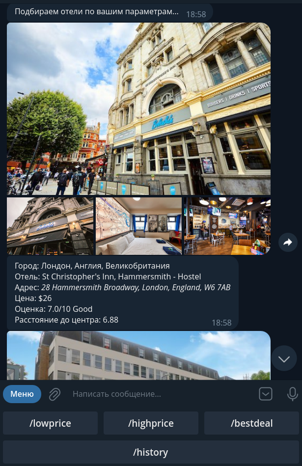

# Описание Telegram-бота
Telegram-бот был разработан для поиска отелей в городах по заданным параметрам. С помощью данного бота пользователи могут искать отели в заданных городах, также пользователи могут настраивать дополнительные параметры для поиска.
## Как использовать бота
1. Добавьте бота в свой список контактов в Telegram.
2. Отправьте команду /start для начала работы с ботом.
2. Ознакомьтесь со списком доступных команд, отправив команду /help.
3. Используйте команды, чтобы задать параметры поиска отелей. 
## Команды бота
- /start  — начало работы с ботом

- /help — получение списка доступных команд

- /lowprice — список отелей, отсортированных по цене от самой низкой к самой высокой

- /highprice — список отелей, отсортированных по цене от самой высокой к самой низкой️

- /bestdeal — список отелей в пределах заданных цены и удаленности от центра

- /history — история последних 5 ваших запросов с найденными отелями

  
## Как установить и запустить бота
1. Склонируйте репозиторий.
2. Получите API-ключ на сайте https://rapidapi.com/apidojo/api/hotels4/.
3. Создайте Telegram-бота и получите токен.
4. Отредактируйте файл .env добавив в него токен вашего Telegram-бота и API ключ от rapidapi:
```python
TELEGRAM_TOKEN = <ваш токен>
RAPIDAPI_KEY = <ваш key>
```
5. Далее можно собрать docker-контейнер на основе dockerfile в корне проекта и запустить контейнер. 
